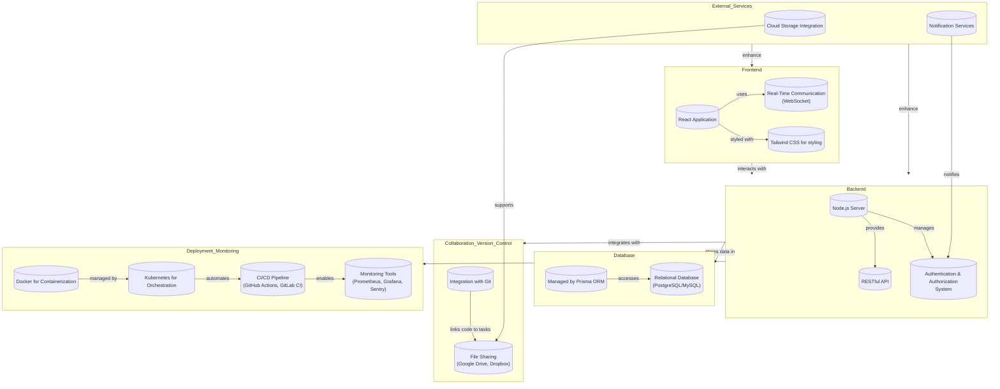

# FullStack-Task-Manager Project

## Introduction

The FullStack-Task-Manager project aims to evolve into an industry-ready web application that facilitates comprehensive task management and collaboration for full-stack application development. This document outlines our development roadmap and presents the planned architecture to guide our team through the phases of development, ensuring alignment and clarity on our goals and strategies.

## Project Architecture

Below is the architecture diagram of the FullStack-Task-Manager, detailing the interactions between its components:

## Development Roadmap

### Phase 1: Foundation Strengthening

- **Enhanced Task Management**: Integrate deadline management and task assignments.
- **Technical Stack Evaluation**: Review and optimize the use of React, Node.js, and Prisma ORM.

### Phase 2: Collaboration Tools Integration

- **Real-time Communication**: Implement chat functionality for immediate team interaction.
- **File Sharing Capability**: Enable document sharing relevant to tasks and projects.

### Phase 3: Deployment and Monitoring

- **Deployment Strategy**: Utilize Docker and Kubernetes for efficient deployment.
- **Performance Monitoring**: Integrate Prometheus, Grafana, and Sentry for comprehensive monitoring.

### Phase 4: Beta Testing and Feedback

- Conduct user testing to gather feedback and make necessary adjustments.

### Phase 5: Final Adjustments and Launch

- **Optimization and Polishing**: Refine features and performance based on feedback.
- **Launch Preparation**: Finalize marketing and support plans for the launch.

## Conclusion

Our commitment to developing the FullStack-Task-Manager into a leading tool for development teams is unwavering. This roadmap and architecture plan lay the groundwork for a scalable, efficient, and collaborative application that meets the complex needs of full-stack projects.
