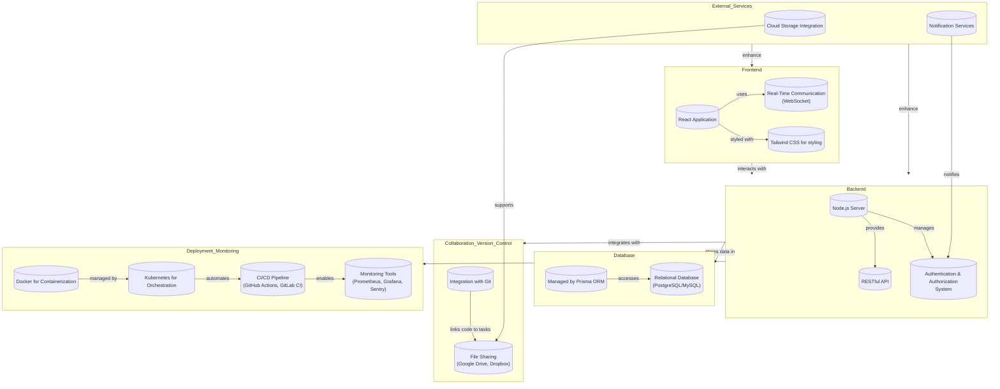

# FullStack-Task-Manager Project

## Introduction

The FullStack-Task-Manager project aims to evolve into an industry-ready web application that facilitates comprehensive task management and collaboration for full-stack application development. This document outlines our development roadmap and presents the planned architecture to guide our team through the phases of development, ensuring alignment and clarity on our goals and strategies.

## Project Architecture

Below is the architecture diagram of the FullStack-Task-Manager, detailing the interactions between its components:

## Architecture Diagram Explanation
This document provides an overview of the architecture of our web application, outlining its key components and their interactions.

### Frontend
The face of the application that users interact with, built using React, which allows for dynamic and responsive user interfaces. It's styled with Tailwind CSS, ensuring the design is both functional and aesthetically pleasing. Real-time communication is achieved through WebSockets, enabling live updates without needing to refresh the page—perfect for chat applications, live notifications, or any feature requiring immediate data updates.

### Backend
This is where the application's logic lives, powered by a Node.js server. It handles requests from the frontend, processes them (e.g., fetching, updating data), and responds accordingly. The RESTful API facilitates this communication in a structured format, making data exchange smooth and consistent. Security is a top priority, managed through a robust authentication and authorization system, ensuring users can only access data they're permitted to.

### Database
At the heart of data storage and management is the Database, supported by Prisma ORM (Object Relational Mapping) and a relational database like PostgreSQL or MySQL. This setup allows for efficient data querying and manipulation, with Prisma abstracting the complexities of direct database interactions, making it easier for developers to work with data.

### Collaboration and Version Control
Development is a team effort, and this system embraces it by integrating with Git for version control, allowing multiple developers to track and merge changes without conflict. Additionally, file-sharing capabilities through services like Google Drive and Dropbox facilitate document and resource sharing among team members, streamlining collaboration.

### Deployment and Monitoring
To ensure the application can be deployed reliably and monitored effectively, the architecture includes Docker for containerization, Kubernetes for orchestration, and a CI/CD pipeline (using tools like GitHub Actions or GitLab CI) for automated testing and deployment. Monitoring tools like Prometheus, Grafana, and Sentry provide insights into the application's performance and health, allowing for proactive maintenance and optimization.

### External Services
The application leverages external services to enhance functionality, including cloud storage integration for additional data storage options and notification services to keep users informed about important events or actions required.

### How It All Fits Together
The frontend makes the application accessible and interactive for users, relying on the backend for processing and data management, which in turn communicates with the database for storage. Collaboration tools streamline development workflows, while deployment and monitoring ensure the application remains available and performs well. External services augment the core capabilities, offering additional features and integrations.

In essence, this architecture diagram paints a picture of a sophisticated web application ecosystem designed for today’s dynamic and collaborative development environment, balancing user experience, operational efficiency, and team productivity.

## Development Roadmap

### Phase 1: Foundation Strengthening

- **Enhanced Task Management**: Integrate deadline management and task assignments.
- **Technical Stack Evaluation**: Review and optimize the use of React, Node.js, and Prisma ORM.

### Phase 2: Collaboration Tools Integration

- **Real-time Communication**: Implement chat functionality for immediate team interaction.
- **File Sharing Capability**: Enable document sharing relevant to tasks and projects.

### Phase 3: Deployment and Monitoring

- **Deployment Strategy**: Utilize Docker and Kubernetes for efficient deployment.
- **Performance Monitoring**: Integrate Prometheus, Grafana, and Sentry for comprehensive monitoring.

### Phase 4: Beta Testing and Feedback

- Conduct user testing to gather feedback and make necessary adjustments.

### Phase 5: Final Adjustments and Launch

- **Optimization and Polishing**: Refine features and performance based on feedback.
- **Launch Preparation**: Finalize marketing and support plans for the launch.

## Conclusion

Our commitment to developing the FullStack-Task-Manager into a leading tool for development teams is unwavering. This roadmap and architecture plan lay the groundwork for a scalable, efficient, and collaborative application that meets the complex needs of full-stack projects.
