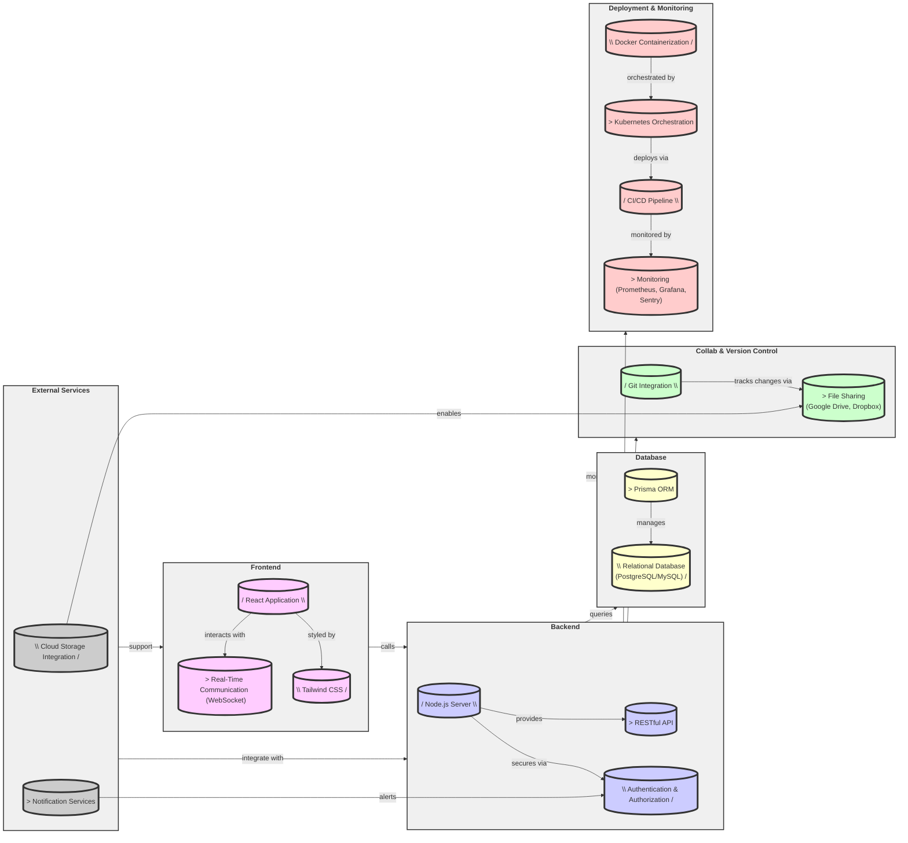

```mermaid
graph LR
    %% Styles
    classDef default fill:#f0f0f0,stroke:#333,stroke-width:2px;
    classDef frontend fill:#ffccff,stroke:#333,stroke-width:4px;
    classDef backend fill:#ccccff,stroke:#333,stroke-width:4px;
    classDef database fill:#ffffcc,stroke:#333,stroke-width:4px;
    classDef collab fill:#ccffcc,stroke:#333,stroke-width:4px;
    classDef deployment fill:#ffcccc,stroke:#333,stroke-width:4px;
    classDef external fill:#cccccc,stroke:#333,stroke-width:4px;

    %% Nodes
    subgraph FE ["<b>Frontend</b>"]
        React[("/ React Application \\")]:::frontend
        WebSocket[("> Real-Time Communication <br> (WebSocket)")]:::frontend
        Tailwind[("\\ Tailwind CSS /")]:::frontend
    end

    subgraph BE ["<b>Backend</b>"]
        NodeJS[("/ Node.js Server \\")]:::backend
        RESTful[("> RESTful API")]:::backend
        Auth[("\\ Authentication & Authorization /")]:::backend
    end

    subgraph DB ["<b>Database</b>"]
        Prisma[("> Prisma ORM")]:::database
        Database[("\\ Relational Database <br> (PostgreSQL/MySQL) /")]:::database
    end

    subgraph CV ["<b>Collab & Version Control</b>"]
        Git[("/ Git Integration \\")]:::collab
        FileSharing[("> File Sharing <br> (Google Drive, Dropbox)")]:::collab
    end

    subgraph DM ["<b>Deployment & Monitoring</b>"]
        Docker[("\\ Docker Containerization /")]:::deployment
        Kubernetes[("> Kubernetes Orchestration")]:::deployment
        CICD[("/ CI/CD Pipeline \\")]:::deployment
        Monitoring[("> Monitoring <br> (Prometheus, Grafana, Sentry)")]:::deployment
    end

    subgraph ES ["<b>External Services</b>"]
        CloudStorage[("\\ Cloud Storage Integration /")]:::external
        Notification[("> Notification Services")]:::external
    end

    %% Connections
    React -->|interacts with| WebSocket
    React -->|styled by| Tailwind
    NodeJS -->|provides| RESTful
    NodeJS -->|secures via| Auth
    Prisma -->|manages| Database
    Git -->|tracks changes via| FileSharing
    Docker -->|orchestrated by| Kubernetes
    Kubernetes -->|deploys via| CICD
    CICD -->|monitored by| Monitoring
    CloudStorage -->|enables| FileSharing
    Notification -->|alerts| Auth
    FE -->|calls| BE
    BE -->|queries| DB
    BE -->|integrates with| CV
    BE -->|monitored & deployed by| DM
    ES -->|support| FE
    ES -->|integrate with| BE

    %% Applying Styles
    class FE,BE,DB,CV,DM,ES default;
```
