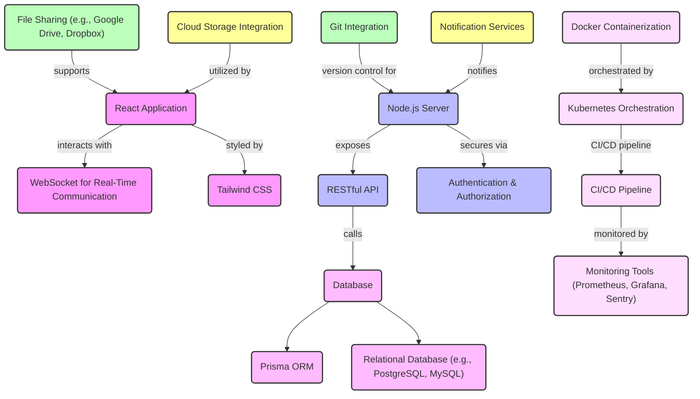

```mermaid
graph TD
    %% Components
    React("React Application")
    WebSocket("WebSocket for Real-Time Communication")
    Tailwind("Tailwind CSS")
    NodeJS("Node.js Server")
    RESTful("RESTful API")
    Auth("Authentication & Authorization")
    DB("Database")
    Prisma("Prisma ORM")
    RDB("Relational Database (e.g., PostgreSQL, MySQL)")
    Git("Git Integration")
    FS("File Sharing (e.g., Google Drive, Dropbox)")
    Docker("Docker Containerization")
    Kubernetes("Kubernetes Orchestration")
    CICD("CI/CD Pipeline")
    Monitoring("Monitoring Tools (Prometheus, Grafana, Sentry)")
    CloudStorage("Cloud Storage Integration")
    Notifications("Notification Services")

    %% Connections
    React -->|interacts with| WebSocket
    React -->|styled by| Tailwind
    NodeJS -->|exposes| RESTful
    NodeJS -->|secures via| Auth
    RESTful -->|calls| DB
    DB --> Prisma
    DB --> RDB
    Git -->|version control for| NodeJS
    FS -->|supports| React
    Docker -->|orchestrated by| Kubernetes
    Kubernetes -->|CI/CD pipeline| CICD
    CICD -->|monitored by| Monitoring
    CloudStorage -->|utilized by| React
    Notifications -->|notifies| NodeJS

    %% Styling
    classDef frontend fill:#f9f,stroke:#333,stroke-width:2px;
    classDef backend fill:#bbf,stroke:#333,stroke-width:2px;
    classDef database fill:#fbf,stroke:#333,stroke-width:2px;
    classDef collab fill:#bfb,stroke:#333,stroke-width:2px;
    classDef deployment fill:#fdf,stroke:#333,stroke-width:2px;
    classDef external fill:#ff9,stroke:#333,stroke-width:2px;

    class React,WebSocket,Tailwind frontend;
    class NodeJS,RESTful,Auth backend;
    class DB,Prisma,RDB database;
    class Git,FS collab;
    class Docker,Kubernetes,CICD,Monitoring deployment;
    class CloudStorage,Notifications external;
```
