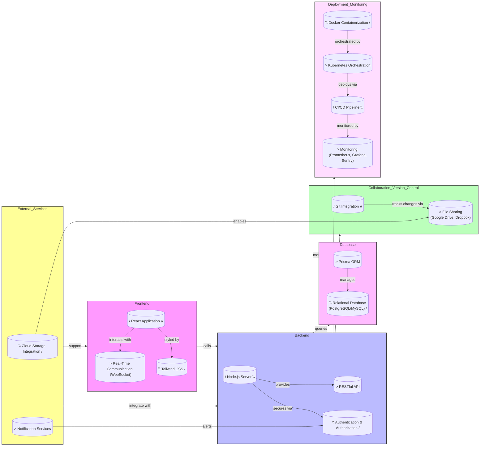

```mermaid
graph LR
    style Frontend fill:#f9f,stroke:#333,stroke-width:2px
    style Backend fill:#bbf,stroke:#333,stroke-width:2px
    style Database fill:#fbf,stroke:#333,stroke-width:2px
    style Collaboration_Version_Control fill:#bfb,stroke:#333,stroke-width:2px
    style Deployment_Monitoring fill:#fdf,stroke:#333,stroke-width:2px
    style External_Services fill:#ff9,stroke:#333,stroke-width:2px

    subgraph Frontend
    React[("/ React Application \\")]
    WebSocket[("> Real-Time Communication <br> (WebSocket)")]
    Tailwind[("\\ Tailwind CSS /")]
    end

    subgraph Backend
    NodeJS[("/ Node.js Server \\")]
    RESTful[("> RESTful API")]
    Auth[("\\ Authentication & Authorization /")]
    end

    subgraph Database
    Prisma[("> Prisma ORM")]
    DB[("\\ Relational Database <br> (PostgreSQL/MySQL) /")]
    end

    subgraph Collaboration_Version_Control
    Git[("/ Git Integration \\")]
    FileSharing[("> File Sharing <br> (Google Drive, Dropbox)")]
    end

    subgraph Deployment_Monitoring
    Docker[("\\ Docker Containerization /")]
    Kubernetes[("> Kubernetes Orchestration")]
    CICD[("/ CI/CD Pipeline \\")]
    Monitoring[("> Monitoring <br> (Prometheus, Grafana, Sentry)")]
    end

    subgraph External_Services
    CloudStorage[("\\ Cloud Storage Integration /")]
    Notification[("> Notification Services")]
    end

    %% Connections
    React -->|interacts with| WebSocket
    React -->|styled by| Tailwind
    NodeJS -->|provides| RESTful
    NodeJS -->|secures via| Auth
    Prisma -->|manages| DB
    Git -->|tracks changes via| FileSharing
    Docker -->|orchestrated by| Kubernetes
    Kubernetes -->|deploys via| CICD
    CICD -->|monitored by| Monitoring
    CloudStorage -->|enables| FileSharing
    Notification -->|alerts| Auth
    Frontend -->|calls| Backend
    Backend -->|queries| Database
    Backend -->|integrates with| Collaboration_Version_Control
    Backend -->|monitored & deployed by| Deployment_Monitoring
    External_Services -->|support| Frontend
    External_Services -->|integrate with| Backend
```
